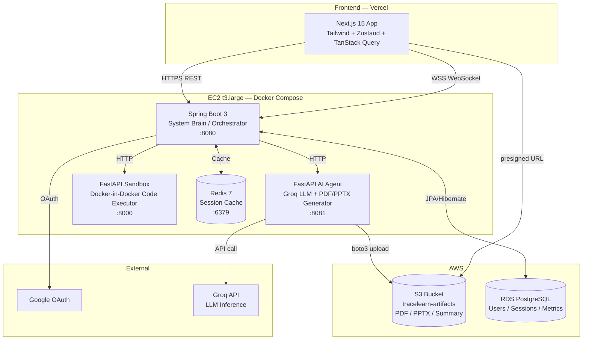
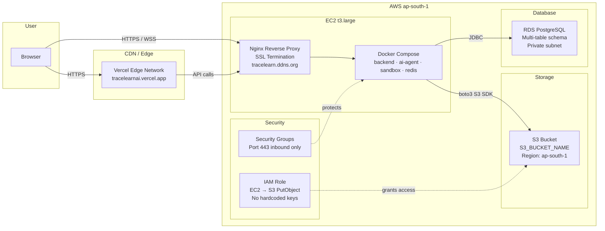

<div align="center">

# 🧠 TraceLearn.ai

### *Turn Every Bug Into a Lesson*

**AI-powered developer learning platform that transforms code errors into personalized, structured learning experiences**

[](https://nextjs.org/)
[](https://spring.io/projects/spring-boot)
[](https://fastapi.tiangolo.com/)
[](https://aws.amazon.com/)
[](https://docker.com/)
[](https://vercel.com/)

[Live Demo](https://tracelearnai.vercel.app) · [Architecture](#-system-architecture) · [Setup](#-setup--installation) · [API Reference](#-api-reference)

---

> **Hackathon Prototype** — Built to demonstrate AI-powered personalized developer education at scale

</div>

---

## 📋 Table of Contents

- [Problem Statement](#-problem-statement)
- [Solution](#-solution)
- [Key Features](#-key-features)
- [System Architecture](#-system-architecture)
- [AWS Architecture](#-aws-architecture)
- [Tech Stack](#-tech-stack)
- [Data Flow](#-data-flow)
- [Setup & Installation](#-setup--installation)
- [API Reference](#-api-reference)
- [Challenges & Solutions](#-challenges--solutions)
- [Future Roadmap](#-future-roadmap)

---

## 🔥 Problem Statement

Every developer — junior or senior — spends a disproportionate amount of time stuck on bugs without understanding *why* they occurred. Existing tools like Stack Overflow and ChatGPT provide answers, but not **structured learning**. Developers:

- Copy-paste fixes without understanding the root cause
- Repeat the same category of errors across projects
- Have no visibility into their own knowledge gaps
- Receive no personalized guidance on what to study next

**The result:** slow skill progression, recurring bugs, and wasted engineering hours.

---

## 💡 Solution

TraceLearn.ai intercepts the debugging workflow and converts it into a **personalized learning loop**:

1. **Upload** buggy code or error logs (Python, Java, JavaScript, and more)
2. **Analyze** — AI agent explains the error, root cause, and fix with step-by-step reasoning
3. **Validate** — Code runs in an isolated Docker sandbox to verify the fix works
4. **Generate** — PDF reports, PowerPoint presentations, and learning summaries are auto-generated
5. **Track** — A personalized roadmap shows knowledge gaps and recommends topics to study next

> TraceLearn.ai doesn't just fix your code. It teaches you *why* it was broken.

---

## ✨ Key Features

### 🔍 Intelligent Error Analysis

- Supports **LIVE_EXECUTION** mode: runs code in an isolated Docker sandbox, captures stdout/stderr, feeds it to the AI
- Supports **LOG_ANALYSIS** mode: for framework-based projects (Spring Boot, FastAPI, Django, Express, NestJS, React) — AI reads logs directly with framework-specific prompts, no Docker execution required
- Auto-detects execution mode based on filename, framework signatures in logs, or explicit user selection

### 🤖 AI-Powered Explanations

- Powered by **Groq** (ultra-fast LLM inference) with structured JSON output
- Returns: root cause analysis, step-by-step reasoning, fixed code, fix analysis, learning resources, and concept breakdowns
- Derives `conceptScores` per analysis — used to build the learning knowledge graph

### 🧪 Code Validation

- Fixed code is re-executed in the sandbox to confirm the fix works
- Up to 3 retry attempts with AI re-analysis on each failure
- Execution results (stdout, stderr, exit code) are stored per attempt

### 📄 Auto-Generated Learning Artifacts

- **PDF Error Report**: Professional report with root cause, fixed code, and step-by-step reasoning
- **PowerPoint Presentation**: 7-slide deck auto-generated with concept visualizations
- **Session Summary PDF**: Compact learning digest for the session
- All artifacts uploaded to **AWS S3** with presigned URLs returned to the frontend

### 🗺️ Personalized Learning Roadmap

- Tracks `LearningMetric` rows per user — concept name, mastery score, encounter count
- Computes **Knowledge Gap Analysis** and **Skill Radar** chart from real session data
- AI generates **Recommended Topics** with estimated time, priority, and curated resources
- **Next Steps** auto-generated from lowest-mastery concepts

### 💬 Contextual Chat

- Post-analysis chat interface with full session context injected
- AI has access to: original error, analysis summary, fix reasoning, and chat history
- Suggested follow-up questions surfaced automatically

### 🔐 Authentication

- Google OAuth via Spring Security
- JWT access tokens stored in `sessionStorage` (cross-tab isolation)
- Custom `AuthEntryPoint` returns clean 401 JSON instead of redirect loop

---

## 🏗️ System Architecture



### Component Responsibilities

| Service | Role | Port |
|---------|------|------|
| **Next.js** (Vercel) | Frontend SPA — file upload, analysis UI, roadmap, artifacts viewer | 443 |
| **Spring Boot** | System Brain — orchestration, auth, session management, async pipelines | 8080 |
| **FastAPI AI Agent** | LLM inference, PDF/PPTX generation, S3 upload | 8081 |
| **FastAPI Sandbox** | Isolated Docker code execution, multi-language support | 8000 |
| **Redis** | Session caching, token store | 6379 |
| **PostgreSQL (RDS)** | Persistent storage — users, sessions, analyses, metrics, artifacts | 5432 |

---

## ☁️ AWS Architecture



### AWS Services Used

| Service | Usage | Why |
|---------|-------|-----|
| **EC2 t3.large** | Hosts all backend Docker containers | Cost-effective, full Docker control |
| **S3** | Stores generated PDF/PPTX/Summary artifacts | Scalable object storage, presigned URL support |
| **RDS PostgreSQL** | Primary database | Managed, reliable, JPA-compatible |
| **IAM Role** | EC2 instance role for S3 access | No hardcoded credentials — security best practice |
| **Security Groups** | Network-level firewall | Port 443 + 8080 only exposed |
| **Elastic IP** | Static IP for EC2 (EC2_IP) | Stable endpoint for DNS mapping |

---

## 🛠️ Tech Stack

### Frontend

| Technology | Version | Justification |
|-----------|---------|---------------|
| **Next.js** | 15 | App Router, SSR/CSR hybrid, Vercel-native deployment |
| **TypeScript** | 5 | Type safety across all API contracts |
| **Tailwind CSS** | 3 | Rapid UI development with design system tokens |
| **Zustand** | 4 | Lightweight global state — auth, session, userId |
| **TanStack Query** | 5 | Server state, caching, background refetch |
| **Framer Motion** | 11 | Polished animations for hackathon demo quality |
| **Recharts** | 2 | Skill Radar chart, mastery visualizations |

### Backend (System Brain)

| Technology | Version | Justification |
|-----------|---------|---------------|
| **Spring Boot** | 3.2 | Production-grade orchestration, async pipelines, Spring Security |
| **Spring Security** | 6 | OAuth2 + JWT, custom AuthEntryPoint for clean 401 responses |
| **Spring WebFlux** | 6 | Reactive WebClient for non-blocking AI agent calls |
| **JPA / Hibernate** | 3 | ORM for PostgreSQL — Users, Sessions, Analyses, Metrics, Artifacts |
| **Redis** | 7 | Session cache, rate limiting |
| **Lombok** | 1.18 | Boilerplate elimination |

### AI Agent

| Technology | Version | Justification |
|-----------|---------|---------------|
| **FastAPI** | 0.109 | High-performance async Python API |
| **Groq SDK** | latest | Ultra-low latency LLM inference (sub-second responses) |
| **ReportLab** | 4 | Programmatic PDF generation |
| **python-pptx** | 0.6 | PowerPoint generation from Python |
| **boto3** | 1.34 | AWS S3 upload of generated artifacts |

### Sandbox (Code Executor)

| Technology | Version | Justification |
|-----------|---------|---------------|
| **FastAPI** | 0.109 | Lightweight execution API |
| **Docker SDK** | 6.1 | Docker-in-Docker isolated execution |
| **pandas / numpy / matplotlib** | latest | Pre-installed so user scripts don't fail on imports |
| **scikit-learn / scipy / Pillow** | latest | Common data science and ML libraries |
| **SQLAlchemy / psycopg2** | latest | Database-using scripts work out of the box |

### Infrastructure

| Technology | Usage |
|-----------|-------|
| **Docker Compose** | Multi-service orchestration on EC2 |
| **Nginx** | Reverse proxy, SSL termination, WebSocket proxying |
| **Vercel** | Frontend deployment with global CDN |
| **Let's Encrypt** | Free SSL for <DNS_DOMAIN> |

---

## 🔄 Data Flow

### LIVE_EXECUTION (Python/JS/Go script with a bug)

```
User uploads buggy code
        │
        ▼
POST /api/v1/analyze (Spring Boot)
        │
        ├─► ExecutionModeDetector → LIVE_EXECUTION
        ├─► WorkspaceService.createWorkspace() → writes code to /tmp/tracelearn/workspaces/{sessionId}/
        ├─► Session created in PostgreSQL (status: CREATED)
        │
        ▼
AsyncPipelineExecutor.runAnalysisPipeline() [async thread pool]
        │
        ├─► POST http://sandbox:8000/sandbox/execute
        │       └─► Docker container runs code → captures stdout/stderr/exitCode
        │
        ├─► POST http://ai-agent:8081/ai/analyze
        │       ├─► Groq LLM call (structured JSON response)
        │       ├─► Returns: explanation, fixedCode, conceptScores, stepByStepReasoning, ...
        │       └─► Normalizes conceptScores → [{conceptName, masteryScore}]
        │
        ├─► AiAnalysis saved to PostgreSQL
        ├─► LearningMetricService.updateMetricsFromScores() → upserts LearningMetric rows
        ├─► WebSocket notification → frontend updates in real time
        │
        └─► triggerArtifactGeneration() [async]
                ├─► POST http://ai-agent:8081/ai/artifacts
                │       ├─► generate_error_report_pdf() → ReportLab → bytes
                │       ├─► generate_presentation_pptx() → python-pptx → bytes
                │       ├─► generate_summary_pdf() → ReportLab → bytes
                │       └─► boto3 S3 upload → presigned URLs
                └─► Artifact URLs saved to PostgreSQL
```

### LOG_ANALYSIS (Spring Boot / FastAPI framework logs)

```
User uploads code + error log file
        │
        ▼
POST /api/v1/analyze
        │
        ├─► ExecutionModeDetector → LOG_ANALYSIS (detects framework signature)
        ├─► WorkspaceService.createWorkspace() → saves code + log to disk
        │
        ▼
AsyncPipelineExecutor.runLogAnalysisPipeline() [Sandbox SKIPPED]
        │
        └─► POST http://ai-agent:8081/ai/analyze
                └─► Framework-aware prompt (Spring Boot / FastAPI / Django / etc.)
                    → Same pipeline as LIVE_EXECUTION from here
```

### Roadmap Generation

```
GET /api/v1/roadmap/{userId}
        │
        ├─► LearningMetricService.getUserMetrics() → reads all LearningMetric rows for user
        ├─► POST http://ai-agent:8081/ai/roadmap
        │       └─► Groq LLM → recommendedTopics, knowledgeGapAnalysis, conceptMasteryScores
        │
        └─► OrchestrationService assembles RoadmapResponse:
                ├─► conceptMastery: from DB metrics → % mastery per concept
                ├─► knowledgeGaps: concepts with masteryPercentage < 50%
                ├─► recommendedTopics: from AI response
                └─► nextSteps: auto-generated from top 3 knowledge gaps
```

---

## ⚙️ Setup & Installation

### Prerequisites

- Node.js 18+
- Java 21+
- Python 3.11+
- Docker & Docker Compose
- AWS account (S3 bucket + EC2 instance)
- Groq API key (free at console.groq.com)
- Google OAuth credentials

### Environment Variables

**Backend (`backend/.env`)**

```env
# Database
SPRING_DATASOURCE_URL=jdbc:postgresql://<RDS_HOST>:5432/tracelearn
SPRING_DATASOURCE_USERNAME=tracelearn
SPRING_DATASOURCE_PASSWORD=<password>

# Redis
SPRING_REDIS_HOST=redis
SPRING_REDIS_PORT=6379

# Google OAuth
SPRING_SECURITY_OAUTH2_CLIENT_REGISTRATION_GOOGLE_CLIENT_ID=<client-id>
SPRING_SECURITY_OAUTH2_CLIENT_REGISTRATION_GOOGLE_CLIENT_SECRET=<client-secret>

# App
FRONTEND_URL=https://tracelearnai.vercel.app
CORS_ORIGINS=https://tracelearnai.vercel.app
JWT_SECRET=<256-bit-secret>

# Service URLs (internal Docker network)
AI_AGENT_URL=http://ai-agent:8081
SANDBOX_URL=http://sandbox:8000
```

**AI Agent (`ai-agent/.env`)**

```env
GROQ_API_KEY=<your-groq-key>
GROQ_MODEL_ID=openai/gpt-oss-120b
AWS_REGION=ap-south-1
S3_BUCKET_NAME=S3_BUCKET_NAME

# IAM role on EC2 provides S3 credentials — no keys needed
```

**Frontend (`.env.local`)**

```env
NEXT_PUBLIC_API_URL=https://<EC2_IP>
NEXT_PUBLIC_WS_URL=wss://<EC2_IP>
```

### Running Locally

```bash
# 1. Clone the repository
git clone https://github.com/your-org/tracelearn-ai.git
cd tracelearn-ai

# 2. Start all backend services
docker-compose up -d

# 3. Install frontend dependencies
cd app
npm install

# 4. Start the frontend dev server
npm run dev
# → http://localhost:3000
```

### EC2 Deployment

```bash
# Upload codebase
scp -r -i your-key.pem ./tracelearn ubuntu@<EC2_IP>:~/

# Build and start all services
cd ~/tracelearn
docker-compose build
docker-compose up -d

# Verify all services are healthy
docker-compose ps
```

---

## 📡 API Reference

### Analysis

| Method | Endpoint | Description |
|--------|----------|-------------|
| `POST` | `/api/v1/analyze` | Submit code/logs for AI analysis |
| `GET` | `/api/v1/sessions/{id}` | Get session status and analysis result |
| `POST` | `/api/v1/sessions/{id}/retry` | Retry with AI-suggested fixed code |
| `POST` | `/api/v1/sessions/{id}/chat` | Send chat message in session context |

**POST /api/v1/analyze — Request Body**

```json
{
  "code": "import pandas as pd\ndf = pd.read_csv('data.csv')",
  "language": "python",
  "filename": "analysis.py",
  "logs": null,
  "frameworkType": null
}
```

### Artifacts

| Method | Endpoint | Description |
|--------|----------|-------------|
| `GET` | `/api/v1/artifacts/{sessionId}` | Get presigned S3 URLs for PDF/PPTX/Summary |

**Response**

```json
{
  "sessionId": "5f184e45-...",
  "artifacts": [
    { "type": "pdf", "s3Url": "https://<S3_BUCKET_NAME>.s3.amazonaws.com/...", "title": "Error Report" },
    { "type": "ppt", "s3Url": "https://...", "title": "Learning Presentation" },
    { "type": "summary", "s3Url": "https://...", "title": "Session Summary" }
  ],
  "learningMetrics": {
    "totalErrorsAnalyzed": 12,
    "conceptsCovered": 8,
    "fixSuccessRate": 75,
    "learningStreakDays": 5
  }
}
```

### Roadmap

| Method | Endpoint | Description |
|--------|----------|-------------|
| `GET` | `/api/v1/roadmap/{userId}` | Get personalized learning roadmap |

**Response**

```json
{
  "conceptMastery": [
    { "category": "Error Handling", "masteryPercentage": 35, "errorFrequency": 7 }
  ],
  "knowledgeGaps": [
    { "category": "Async", "masteryPercentage": 20 }
  ],
  "recommendedTopics": [
    { "title": "Python Async/Await", "priority": "high", "estimatedMinutes": 90 }
  ],
  "nextSteps": [...],
  "analysisBasedOn": 12
}
```

### WebSocket Events

```
wss://<EC2_IP>/ws/session/{sessionId}

Events emitted by server:
  SESSION_UPDATE   → { status: "ANALYZING" | "ANALYZED" | "ERROR" }
  ANALYSIS_COMPLETE → { explanation, fixedCode, conceptBehindError, ... }
  EXECUTION_COMPLETE → { attemptNumber, status: "SUCCESS" | "FAILED" }
  ARTIFACT_STATUS  → { status: "GENERATING" | "COMPLETED" | "FAILED" }
  CHAT_REPLY       → { message, suggestedFollowUps }
```

---

## 🧩 Challenges & Solutions

### 1. Cross-Domain Cookie Problem (OAuth + Vercel + EC2)

**Problem:** Frontend on Vercel (`tracelearnai.vercel.app`) and backend on EC2 are different domains. Refresh token cookies set by Spring Security were blocked by browsers (SameSite policy).

**Solution:** Migrated token storage to `sessionStorage` instead of `localStorage` to prevent stale token persistence. Removed the refresh token flow entirely — the slow path now redirects to sign-in cleanly. `AuthEntryPoint` returns JSON 401 instead of triggering a redirect loop.

### 2. Sandbox Library Gap (ModuleNotFoundError instead of real bug)

**Problem:** Users uploading pandas/numpy/sklearn code got `ModuleNotFoundError` analyzed by the AI instead of their actual bug — completely wrong learning output.

**Solution:** Pre-installed 15+ common data science and utility libraries in the sandbox Docker image (`pandas`, `numpy`, `matplotlib`, `scikit-learn`, `scipy`, `SQLAlchemy`, `Pillow`, etc.) so user scripts execute in a realistic environment.

### 3. Framework Code Can't Run in Sandbox

**Problem:** Spring Boot and FastAPI applications can't be executed in a generic Docker sandbox — they require full application context, databases, and ports.

**Solution:** Built an `ExecutionModeDetector` that inspects the filename, framework type field, and log content for framework signatures. Framework projects skip the sandbox entirely and go to `LOG_ANALYSIS` mode where the AI reads logs directly with framework-specific prompts.

### 4. ReportLab Integer Bullet Crash

**Problem:** `ListItem(value=i+1)` passed an integer to ReportLab's `asUnicode()` which expected a string — crashing all artifact generation with `AttributeError`.

**Solution:** Removed the `value=` parameter entirely. Step numbers were already embedded in the paragraph text (`Step 1:`, `Step 2:`).

### 5. LLM Field Name Inconsistency

**Problem:** The Groq LLM sometimes returned `conceptName`/`masteryScore`, sometimes `concept`/`score` for learning metrics — causing Pydantic validation errors that crashed the analyze endpoint.

**Solution:** Added a normalization layer in `call_analyze_llm()` that maps any variant (`concept`/`conceptName`, `score`/`masteryScore`) to the canonical `{conceptName, masteryScore}` before Pydantic validation. Added a fallback that derives concept scores from `conceptBehindError` when the LLM returns nothing.

### 6. Spring Security Returning 302 Instead of 401

**Problem:** Unauthenticated API calls returned `302 → /login` redirect. The browser followed the redirect to a non-existent login page, triggering a CORS error instead of a clean 401.

**Solution:** Implemented a custom `AuthEntryPoint` that intercepts unauthenticated requests and returns `{"error": "Unauthorized"}` JSON with HTTP 401, with proper CORS headers.

### 7. Async Thread Pool Architecture

**Problem:** Analysis pipelines involve 3–4 sequential I/O calls (sandbox → AI → artifact generation). Blocking the HTTP thread caused timeout issues and poor throughput.

**Solution:** Implemented three dedicated thread pools — `taskExecutor` (orchestration), `sandboxExecutor` (Docker calls), `analysisExecutor` (LLM calls) — with `@Async` on all pipeline methods. HTTP response returns in milliseconds; frontend polls via WebSocket.

---

## 🚀 Future Roadmap

### Phase 2 — Production Hardening (1–2 months)

- [ ] **Multi-language sandbox**: Full support for Java, JavaScript/Node.js, Go, Rust with language-specific Docker images
- [ ] **Rate limiting**: Per-user analysis quotas via Redis
- [ ] **Workspace cleanup**: TTL-based workspace deletion to prevent disk bloat
- [ ] **RDS Read Replica**: Separate read path for roadmap/metrics queries

### Phase 3 — Learning Intelligence (2–4 months)

- [ ] **Spaced repetition**: Re-surface concepts the user struggled with at optimal intervals
- [ ] **Peer comparison**: Anonymous benchmarking — "You're in the top 30% for Error Handling mastery"
- [ ] **Error pattern clustering**: ML-based grouping of similar errors across the user base
- [ ] **Progress certificates**: Auto-generated learning certificates for concept mastery milestones

### Phase 4 — Team & Enterprise (4–6 months)

- [ ] **Team workspaces**: Shared error libraries and team-level knowledge gap dashboards
- [ ] **CI/CD integration**: GitHub Actions plugin — automatically analyze test failures in PRs
- [ ] **IDE extensions**: VS Code extension that triggers analysis on runtime errors inline
- [ ] **LMS integration**: Export learning data to platforms like Coursera, edX, or internal LMSes

### Phase 5 — Platform Scale

- [ ] **ECS / Fargate migration**: Replace EC2 Docker Compose with container orchestration for auto-scaling
- [ ] **CloudFront CDN**: Serve artifacts directly from CloudFront instead of S3 presigned URLs
- [ ] **Aurora Serverless**: Replace RDS with Aurora for automatic scaling
- [ ] **Multi-region**: Deploy sandbox workers across AWS regions for low-latency global execution

---

## 👥 Team

Built with ❤️ for the AWS Hackathon — demonstrating that developer tooling and personalized AI education can coexist in a single, cohesive product.

---

<div align="center">

**TraceLearn.ai** — *Every bug is a lesson waiting to be learned.*

[](https://tracelearnai.vercel.app)
<!-- [](https://tracelearn.hopto.org) -->

</div>
